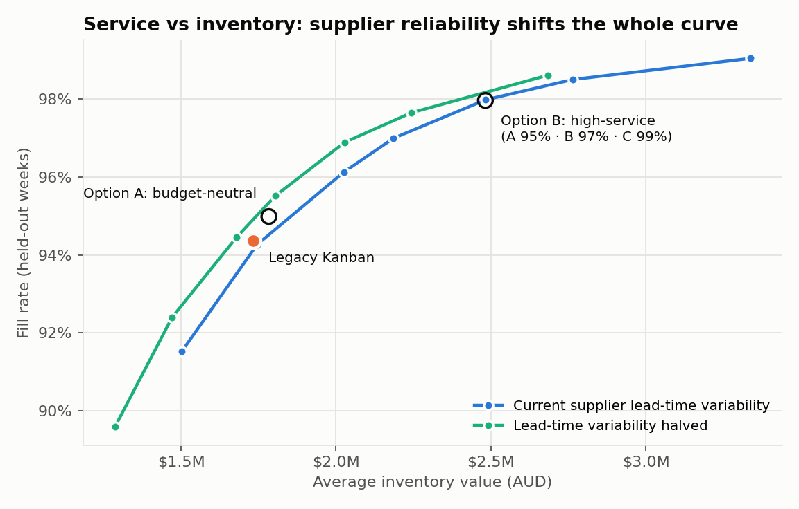
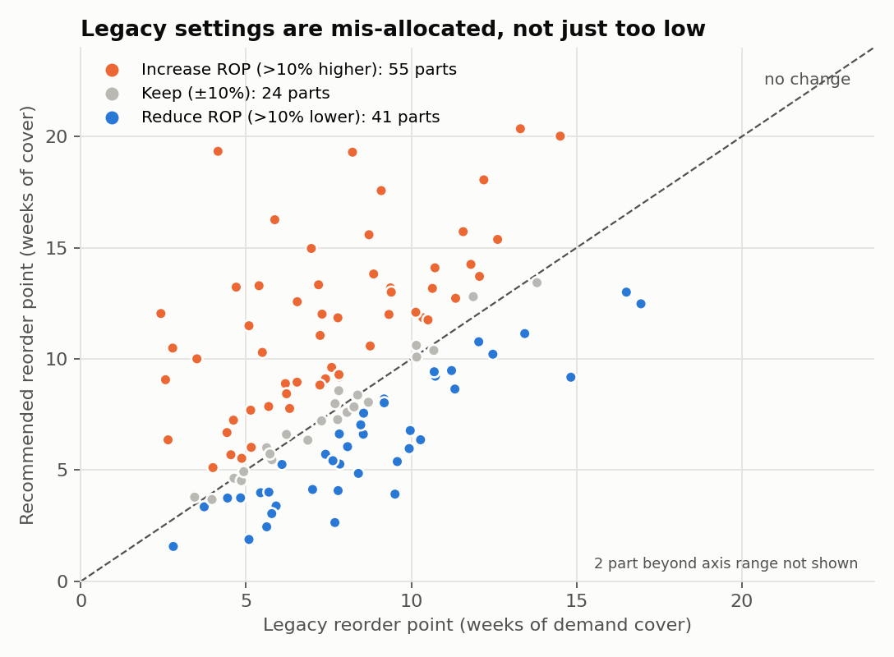
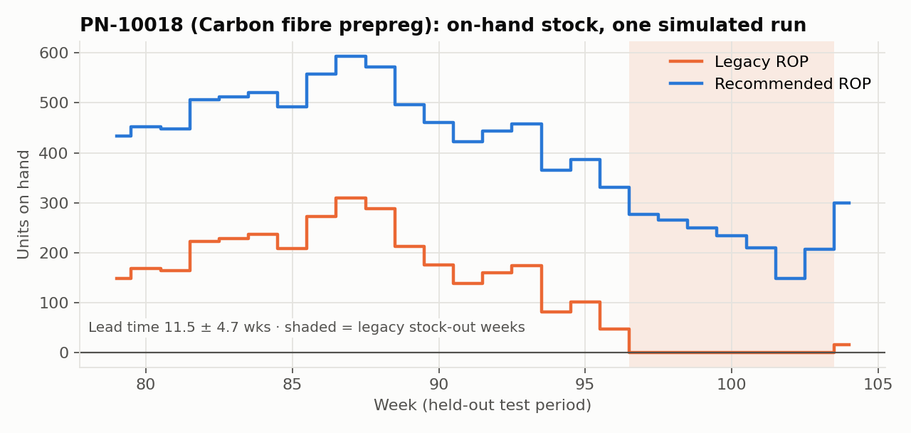
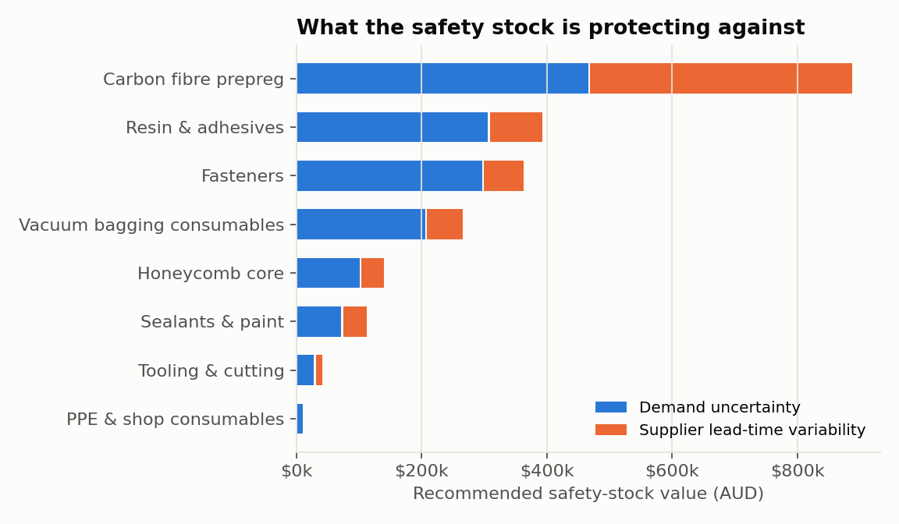

# Kanban Reorder-Point Optimisation

Data-driven Kanban reorder-point optimisation for 120 manufacturing parts – demand forecasting, safety stock and Monte Carlo simulation (Python).

**Using inventory and replenishment data to re-set Kanban reorder points for an aerospace composite-parts manufacturer, then testing the new settings with a Monte Carlo simulation before anything changes on the shop floor.**

`Python` · `pandas` · `NumPy` · `SciPy` · `matplotlib` · `Monte Carlo simulation` · `demand forecasting` · `inventory optimisation` · `lean / Kanban`

---

## Business problem

A composite-parts manufacturing site runs a multi-card Kanban system for **120 production parts and consumables**: carbon-fibre prepreg, resins and adhesives, fasteners, honeycomb core, vacuum-bagging consumables and similar. Each reorder point (ROP) was set by a buyer when the part was introduced, using *quoted lead time + a 1–6 week buffer × first-year average demand*. Most have not been reviewed since.

Since then the production rate has grown about 15% and supplier lead times have turned out to be variable. The supply chain team wants to know:

1. Which parts matter most?
2. How well do today's Kanban settings actually protect production?
3. What should the reorder points be, and what would that cost in inventory?
4. Where is the biggest lever: our own settings, or supplier reliability?

> **Data:** the dataset is **simulated** (`src/generate_data.py`, fixed random seed). It is designed to behave like real ERP/MRP data: mixed smooth, erratic and intermittent demand, variable supplier lead times, a production ramp-up and legacy settings based on judgement. **No company data is used.** The pipeline runs unchanged on a real extract of weekly consumption, the part master and goods-receipt history.

## Approach

| Step | What I did |
|---|---|
| **Segment** | ABC analysis on consumption value (80/15/5), XYZ analysis on demand variability, and Syntetos–Boylan classification (smooth, erratic, intermittent or lumpy) |
| **Forecast** | Six candidate methods per part (moving averages, exponential smoothing, Croston-SBA for intermittent demand), chosen by rolling-origin validation. The error of the chosen method becomes the demand-uncertainty input |
| **Size** | Safety stock covering **both** demand and lead-time uncertainty: SS = z·√(LT·σd² + d̄²·σLT²). ROP = d̄·LT + SS. Kanban cards = ⌈ROP / container⌉ + 1 |
| **Test** | A week-by-week **Monte Carlo simulation** of the Kanban loop with random supplier lead times: 100 runs per part per policy on **held-out demand** (weeks 79–104) that the model never saw |
| **Decide** | A service-level vs inventory trade-off curve, plus a "what if suppliers were more reliable?" scenario |

## Key results (held-out test period, 120 parts)

| KPI | Legacy Kanban | **Option A**: budget-neutral rebalance | **Option B**: high service |
|---|---|---|---|
| Fill rate (volume-weighted) | 94.4% | 95.0% | **98.0%** |
| Stock-out weeks, all parts (26 wks) | 294 | 187 (**−36%**) | 74 (**−75%**) |
| Parts below 95% fill rate | 38 | 28 | **10** |
| Average inventory value | $1.73M | $1.78M (+3%) | $2.48M (+43%) |

- **The legacy settings are mis-allocated, not just too low.** 41 parts are over-stocked and should have their ROP cut by more than 10%. 55 long-lead or volatile parts are under-protected.
- **With no extra budget (Option A)**, moving stock to the right parts cuts stock-out weeks by about a third.
- **Protecting production costs money (Option B).** The trade-off curve lets management choose a service level on purpose.
- **Supplier reliability is a lever as well as our own settings.** About **32% of safety-stock value exists only to absorb supplier lead-time variability**, and **5 suppliers account for 47% of that**. Halving their variability gives the same service with **about 6% less inventory**. This leads directly into supplier performance reviews (see the companion project, *Supplier Performance & Procurement Analytics*).
- Choosing a forecast method per part lowered forecast error (WAPE) from 54.8% to 51.7% compared with a single method for every part. The larger gain comes from sizing safety stock correctly, not from the forecast itself.









## Recommendations

1. **Re-set ROPs from data.** Start with Option A (no extra budget) and move the long-lead A-class parts towards Option B.
2. **Take the lead-time evidence into supplier reviews.** Focus on the 5 suppliers behind most of the lead-time-driven safety stock.
3. **Review quarterly.** Demand has moved about 15% since the legacy settings were made. Re-run the notebook on a fresh ERP extract.
4. **Hand buyers a usable output.** `data/recommended_kanban_settings.csv` lists the part, class, forecast method, legacy and recommended ROP, % change, number of Kanban cards and simulated fill rates.

## Repository structure

```
├── data/
│   ├── parts_master.csv                 # 120 parts: category, supplier, cost, lead time, container qty, legacy ROP
│   ├── weekly_demand.csv                # 104 weeks of consumption per part
│   ├── receipts_log.csv                 # ~2,000 historical orders with actual lead times
│   ├── recommended_kanban_settings.csv  # OUTPUT: new settings for buyers
│   └── headline_results.json            # OUTPUT: KPIs quoted above
├── images/                              # charts used in this README
├── notebooks/
│   ├── kanban_reorder_point_optimisation.ipynb   # full analysis (executed)
│   └── kanban_reorder_point_optimisation.py      # same notebook as a plain script (jupytext)
└── src/
    ├── generate_data.py                 # reproducible simulated dataset
    ├── inventory.py                     # classification, forecasting, safety stock, Kanban simulation
    └── style.py                         # chart styling
```

## How to run

```bash
pip install -r requirements.txt
python src/generate_data.py          # optional: regenerates the data (seeded, so the results are identical)
jupyter notebook notebooks/kanban_reorder_point_optimisation.ipynb
```

## Limitations and next steps

- The data is simulated. On real data, check the part master, container sizes and the lead-time definition (order → receipt vs order → available to production).
- Weekly review is assumed. A daily or electronic Kanban signal would lower the required stock a little.
- Next steps: add supplier minimum order quantities and shelf-life limits (prepreg has a freezer life), and build a Power BI dashboard over the output file for the buyers.

---
*Author: Anoop Channaiah, Master of Business Analytics, Deakin University · [LinkedIn](https://linkedin.com/in/anoop-c-4b99b1228)*
